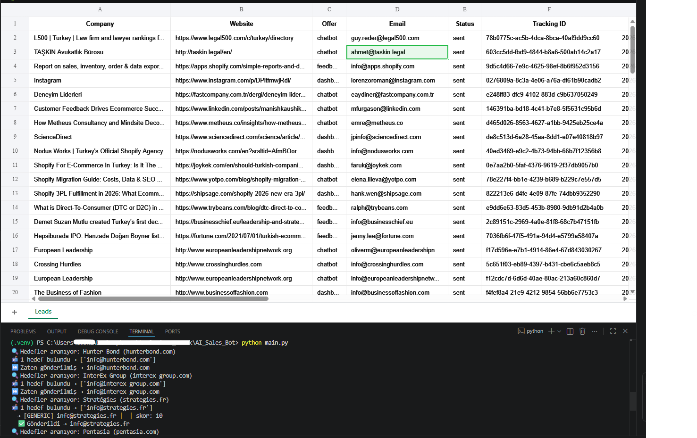

# 🚀 AI Sales Bot

AI Sales Bot is an end-to-end **AI-powered outbound sales automation system** that finds, analyzes, and reaches out to potential customers with highly personalized emails.

It eliminates manual prospecting, research, and cold emailing — turning your outbound workflow into a fully automated pipeline.

---

## 🧠 How It Works

```text
Lead Generation → Company Analysis → Email Discovery → AI Email Writing → Sending → Logging
```

### 🔄 Full Workflow

1. **Lead Generation**

   * Finds companies via Apollo API
   * Uses Google (SerpAPI) as a fallback source

2. **Website Analysis**

   * Scrapes company websites
   * Filters for small businesses

3. **AI Analysis**

   * Extracts:

     * Industry
     * Pain points
     * Language/tone

4. **Offer Selection**

   * Dynamically selects the best offer:

     * Feedback system
     * Chatbot
     * Dashboard

5. **Email Discovery**

   * Finds decision-makers (CEO, HR, etc.)
   * Includes generic emails (info@)
   * Uses multiple sources + verification

6. **Personalized Email Generation**

   * Generates a unique AI email for each contact

7. **Sending & Tracking**

   * Sends emails
   * Adds tracking ID
   * Logs results into Google Sheets

---

## 🏗️ Project Structure

```text
AI_Sales_Bot/
│
├── main.py                  # Main orchestrator
│
├── lead_generation/
│   └── scraper.py          # Apollo + Google lead generation
│
├── enrichment/
│   └── email_finder.py     # Email discovery & verification
│
├── ai/
│   ├── analyzer.py         # Company analysis
│   ├── offer_selector.py   # Offer selection
│   └── email_writer.py     # Email generation
│
├── mailer/
│   └── sender.py           # Email sending
│
├── database/
│   └── sheets.py           # Google Sheets integration
│
├── config.py
└── .env
```

---

## ⚙️ Installation

### 1. Clone the repository

```bash
git clone https://github.com/yourusername/AI_Sales_Bot.git
cd AI_Sales_Bot
```

### 2. Install dependencies

```bash
pip install -r requirements.txt
```

### 3. Create a `.env` file

```env
OPENAI_API_KEY=
APOLLO_API_KEY=
SERPAPI_KEY=
HUNTER_API_KEY=
SNOV_API_KEY=
ABSTRACT_API_KEY=

EMAIL_HOST=
EMAIL_PORT=
EMAIL_USER=
EMAIL_PASS=
```

---

## ▶️ Usage

```bash
python main.py
```

Once started, the bot will:

* Discover companies
* Analyze them
* Generate and send emails
* Log everything into Google Sheets

---

## 📊 Features

### 🤖 AI-Powered

* Company analysis (LLM-based)
* Dynamic offer selection
* Personalized email generation

### 🎯 Lead Generation

* Apollo API integration
* Google fallback (SerpAPI)

### 📬 Email Intelligence

* Multi-source email discovery
* Email verification (Hunter + Abstract)
* Scoring system

### 📈 Tracking

* Google Sheets logging
* Duplicate prevention
* Unique tracking IDs

### ⚡ Smart Sending System

* Daily sending limits
* Random delays (anti-spam)

---

## 🧩 Configuration

Adjust settings via `config.py`:

```python
APOLLO_KEYWORDS = [...]
GOOGLE_KEYWORDS = [...]
DAILY_LIMIT = 50
MIN_DELAY = 10
MAX_DELAY = 30
```

---

## 🛡️ Best Practices

* Built-in rate limiting
* Duplicate email prevention
* API fallback mechanisms
* Optimized for free-tier API usage

---

## 📸 Demo



## 🚧 Roadmap

* 📩 Email open & reply tracking
* 🌍 Multi-language support
* 🧠 CRM integrations
* 📊 Analytics dashboard
* 🔁 Automated follow-ups

---

## 📌 Use Cases

This project is ideal for:

* SaaS founders
* Growth hackers
* Agencies

Looking to scale outbound sales **10x faster** with AI.

---

## 🧑‍💻 Contributing

Pull requests and contributions are welcome.

---

## 📜 License

MIT License
